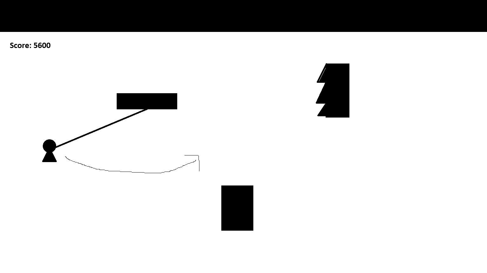

# Spider Swing - ゲーム仕様書

## ゲーム概要
「Spider Swing」は、プレイヤーが粘着性の糸を使って障害物を避けながら進む横スクロールアクションゲームです。プレイヤーは糸を天井や障害物に付着させ、スイングしながら進んでいきます。

## 基本システム

### 画面構成
- 横スクロール形式
- 画面上部に常に天井が存在
- プレイヤーは画面左側に位置
- 障害物は画面内にランダムに配置

### プレイヤーの操作

#### 基本操作
- **スペースキー**: ゲーム開始
- **マウス左クリック**: 糸を発射・維持
- **上キー**: 糸を上る（糸の長さを短くする）
- **下キー**: 糸を下る（糸の長さを長くする）

#### 移動メカニズム
1. **通常移動**: 障害物の上を歩いて移動
2. **スイング移動**: 糸を使って空中をスイング

### 糸のメカニズム
- マウスで左クリックした場所に糸を発射
- 糸は天井または障害物に付着
- 左クリックを押している間、糸は付着し続ける
- 左クリックを離すと、糸が切れる
- 糸の長さに応じて、プレイヤーは弧を描いてスイング
- 上キー・下キーで糸の長さを調整可能

### ゲームの進行
- スペースキーでゲーム開始
- 画面は自動的に右にスクロール
- プレイヤーは障害物を避けながら進む
- スコアは生存時間または移動距離に基づいて計算

### ゲームオーバー条件
1. プレイヤーが障害物の側面に衝突
2. プレイヤーが画面下部に落下
3. プレイヤーが画面左端より後ろに取り残される

## 技術仕様

### 開発環境
- HTML5 Canvas
- JavaScript
- 必要に応じてゲームフレームワーク（Phaser.jsなど）

### ゲームオブジェクト

#### プレイヤー
- サイズ: 適切な大きさ（画面の5%程度）
- 物理特性: 重力の影響を受ける
- アニメーション: 走る、スイングする、上る、下るなどの動作

#### 糸
- 物理特性: 伸縮性、張力
- 視覚効果: 糸の長さに応じた描画
- 付着ポイント: 天井または障害物との接点

#### 障害物
- 種類: 様々な形状と大きさ
- 配置: ランダムまたは設計されたレベルデザイン
- 物理特性: 固体、プレイヤーが上に乗れる

#### 背景
- パララックススクロール効果
- 複数のレイヤーで奥行き感を演出

### 物理エンジン要件
- 重力シミュレーション
- 振り子運動（スイング）の計算
- 衝突検出

### UI要素
- スコア表示
- ゲームオーバー画面
- リスタートボタン
- チュートリアル表示（初回プレイ時）

## 拡張機能（将来実装）
- 複数のレベル
- パワーアップアイテム
- 異なる種類の糸（伸縮性、強度など）
- マルチプレイヤーモード
- ハイスコアランキング

## アセット要件
- プレイヤーキャラクターのスプライト
- 障害物の画像
- 背景画像
- 効果音（糸の発射、付着、スイング、衝突など）
- BGM

## 実装ステップ
1. 基本的なゲーム環境のセットアップ
2. プレイヤーの移動と物理演算の実装
3. 糸のメカニズムの実装
4. 障害物の配置とスクロールの実装
5. 衝突判定とゲームオーバー条件の実装
6. UI要素の追加
7. グラフィックとサウンドの統合
8. バランス調整とデバッグ
